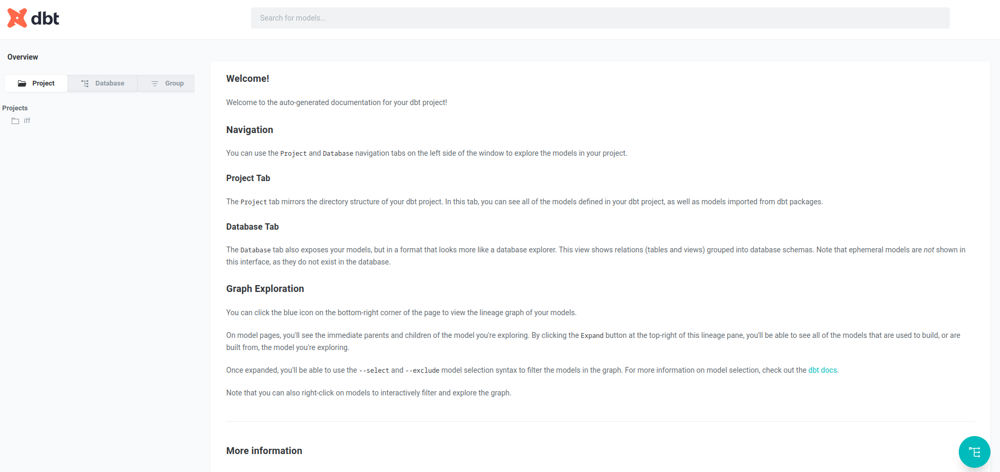
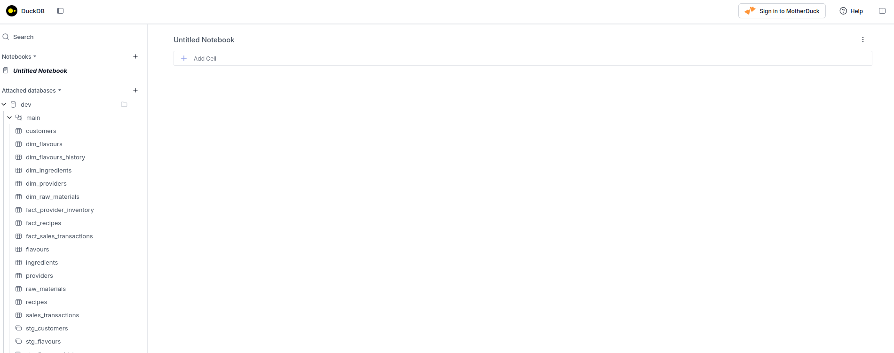
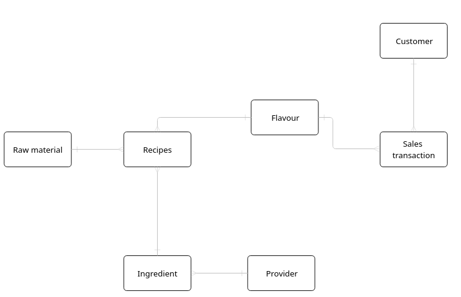
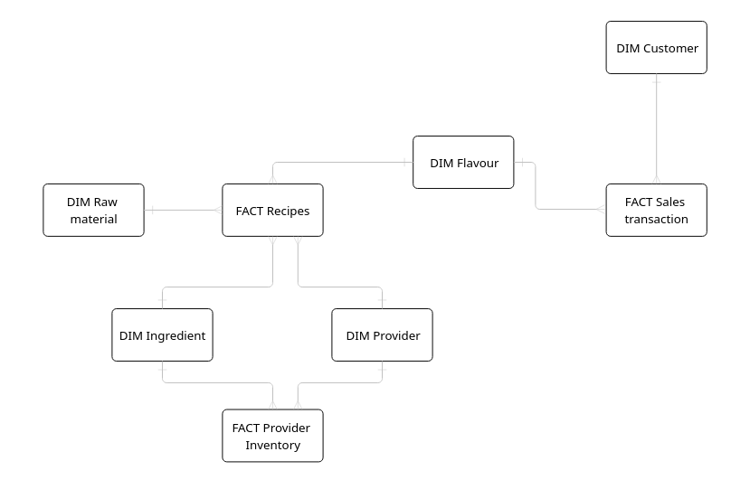

# IFF GDE

Welcom to the IFF - Global Data Engineer challange! The objective is to take freshly delivered business data and prepare it in a way that enables multiple teams - analytics, operations, sales, and creative - to confidently answer their questions and build dashboards for stakeholders.

## Stack
Technologies used:
  - [DuckDB](https://duckdb.org/) - DuckDB was chosen because it is lightweight, local analytical database. Meaning we can run analytical queries without a cloud provider.
- [dbt](https://www.getdbt.com/) - dbt was chosen because it enables modular, testable, and well-documented transformations using SQL, making data models easy to maintain and trust as they evolve.

For a larger enterprise project a cloud based database like Snowflake would be more appropriate. Still for small production projects DuckDB might just lower the operation cost as we wouldn't rely on Snowflake. While choosing a technology we should always have cost in mind along with the complexity that we actually need.

For this task I went with an ELT process, which works well for a layered approach. dbt helps a lot with this as we can write transformations, tests and documentation in one codebase. 

## Requirements

Make sure that the following is installed on your computer:
  - [Python](https://www.python.org/downloads/)
  - [Docker](https://docs.docker.com/engine/install/)

## Instructions

Instructions for running the code.

### Docker (recommended)

1) Clone the repository: `git clone https://github.com/zmazk123/iff-gde.git`

2) Make sure you are in the project folder: `cd iff-gde`

3) Run: `docker compose up`

This will seed the database from the csv files, run the transformations and tests and spin up dbt documentation server at http://localhost:8001.

Wait for the process to finish (some tests fail - that is fine). A .duckdb file should appear in [./duckdb_data](./duckdb_data) as we have a volume mounted to the container.

Now we need to spin up [DuckDB UI](https://duckdb.org/docs/stable/operations_manual/duckdb_docker) so that we can query the database.

4) Run (make sure you are in the project folder /iff-gde): `docker run --rm -it -v "./duckdb_data:/workspace" -w /workspace --net host duckdb/duckdb`

5) In container we have duckdb CLI and run: `ATTACH '/workspace/dev.duckdb';`

5) In container duckdb CLI run: `CALL start_ui();`

DuckDB UI should be accesible at http://localhost:4213/.

### Locally

If you are unable to setup with Docker you can spin it up locally.

1) Set up a Python virtual environment. I recommend [venv](https://docs.python.org/3/library/venv.html).

2) Install Python packages: `pip install -r requirements.txt`

3) Install [DuckDB](https://duckdb.org/install/?platform=linux&environment=cli)

4) Run: `dbt seed`

5) Run: `dbt run`

6) Run: `dbt test`

7) Run: `dbt docs generate`

8) Run: `dbt docs serve --port 8001`

9) Spin up DuckDB UI: `duckdb -ui`

Now we should have a working setup.

If you check the documentation at: http://localhost:8001 you should see:

If you check DuckDB UI at: http://localhost:4213/ you should see: 

You should se the "dev" database with all the tables and views. You can that use the notebook on the right to query them.

## Approach

The data model was built using a layered approach or a Medallion architecture to clearly separate concerns and keep the system easy to understand and extend. This structure makes transformations predictable, reusable, and easier to reason about as the warehouse grows.

 - [Raw data](./seeds) (Bronze) is provided from the csv files and seeded in the db.
 - [Staging models](./models/staging/) (Silver) focus on cleaning, typing, deduplication and introduce surrogate keys.
 - [Final models](./models/marts/) (Gold) are designed around business questions using facts and dimensions. 

The most significant change to the original model:

is the introduction of a new fact table Provider Inventory in the Gold layer:

The reason for that is that I noticed that some ingredients are the same. For a unique identifier I used name+chemical_formula. They only had different providers. So it made sense to separate them to a different dimension. In the Provider Inventory the grain should be ingredient X provider (but a test discovered a data smell here! More on that later.).

I also linked Providers with Recipes using a surrogate key to maintain a star schema.

### Unpivoting recipes

Given more information and time, we should also unpivot Recipes. For now a recipe has ingredient, flavour and raw_material. But what if we required more fields in the future to make a recipe, for example water? If we keep adding them, the table blows up.

In that case it would make sense to format recipes like:

--------------------------------------------------
| recipes                                         |
| ------------------------------------------------|
| recipe_id                                       |
| component_id                                    |
| component_ratio                                 |
| heat_process                                    |
| yield                                           |
--------------------------------------------------

With this we can compose a recipe with any component that we would need. And the design is change proof.

### DBT docs

I documented minor decision I took along the way using DBT docs. You can explore them at: http://localhost:8001

## Tests

We can write tests directly in DBT. You will notice that some tests fail! That's ok - it means they are doing their job. 

For exaple a [relationship](https://docs.getdbt.com/reference/resource-properties/data-tests#relationships) test between Ingredients and Providers fail because we have some ingredients that have a provider_id that does not exist in Providers. With this info we can research the issue upstream.

Another example is a uniqueness test on Provider Inventory. We specified the grain of ingredient X provider. But the test found some cases where that is not true. So we have a duplication. Same ingredient from same provider in the same batch. Which row is correct? This indicates a data smell we should look into. (Ingredient ids: 374 and 390)

However in the scope of this project I will not be identifying the source of the issue or applying a fix.

## Further improvements

There is a lot of work to be done:

 - Add dbt [sources](https://docs.getdbt.com/docs/build/sources) to document and test the source tables.
 - Identify any potential logic or data duplication and clean up the code.
 - Add more extensive documentation.
 - Run dbt commands on a schedule using something like Airflow.
 - Add more elaborate tests and add more tests to the gold layer.

